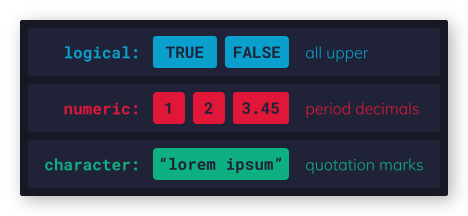
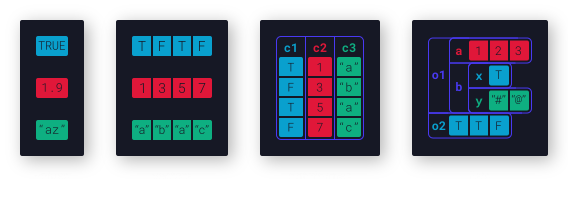
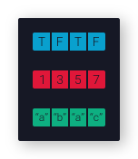
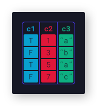
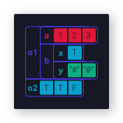
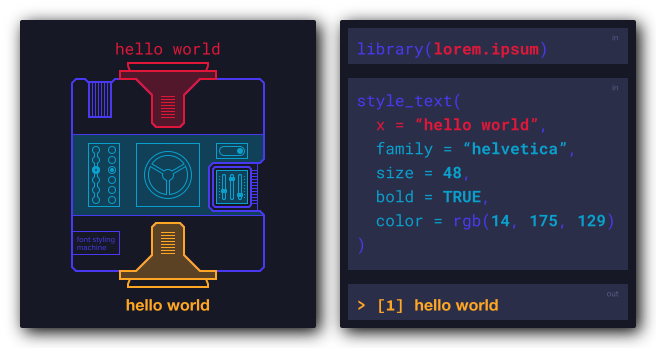

# Introductie

::: {.intro2 .blue}
In dit document vind je de belangrijkste basis elementen die je nodig hebt om te starten met R. Om dit document te begrijpen heb je geen ervaring nodig met programmeren en zeker niet met R. Kort gezegd; we beginnen bij het begin.
:::

Om R werkelijk te doorgronden en te kunnen gebruiken is het handig om de achterliggende logica van de tool (programmeertaal) te begrijpen. Dit document beschrijft de achterliggende logica door de tool op te breken in de kleinste deeltjes. Aan het einde van het document weet je hoe R data interpreteert, hoe je data kunt filteren en indexeren, hoe functies werken en hoe je packages kunt gebruiken. Je kunt het document het beste van boven naar beneden lezen als R helemaal nieuw voor je is, maar je kunt het document ook als naslag gebruiken mocht je bepaalde zaken nog een keer willen opzoeken. Ieder hoofdstuk heeft een tl;dr (too long didn't read) sectie dat het hele hoofdstuk samenvat in een paar zinnen, om sneller door de hoofdstukken te kunnen skippen als dat nodig is. In dit document komen de volgende hoofdstukken aan bod:

-   Interface en basisbegrippen;
-   assignment;
-   data types;
-   data structuren;
-   indexeren;
-   functies;
-   pakketten.

## Wat is R?

R is een programmeertaal speciaal ontwikkeld voor data analyse, mathematiek, statistiek en machine learning met miljoenen gebruikers wereldwijd. Daarnaast is R open source en gratis te gebruiken voor iedereen - altijd. Dit maakt dat R is uitgegroeid tot een uitgebreid ecosysteem met 1000'en pakketten, boeken, tutorials, forums en andere resources die bedoeld zijn jouw het werk makkelijker te maken binnen je alledaagse dataprojecten makkelijker.

Om te begrijpen hoe R werkt, kun je R het beste vergelijken met een enorme toolkit vol met gereedschappen, apparaten en machines die je kunt gebruiken om je eigen fabriek te bouwen. In de R fabriek zijn de functies de gereedschappen en data is de grondstof. Wanneer je een beetje tijd investeert in het begrijpen van de gereedschappen en de grondstoffen kun je productieketens ontwerpen en bouwen voor alle uitdagingen op het gebied van data die je kunt bedenken.

# Interface en basisbegrippen

::: {.intro2 .gray}
Als je nog nooit met een programmeertaal gewerkt hebt is het misschien goed om eerst de interface te bespreken en een aantal basis begrippen te introduceren. We gaan er vanuit dat je de [RStudio IDE](https://www.rstudio.com/products/rstudio/) gebruikt.
:::

### IDE

IDE staat voor integrated development environment. Dat is een tool waarin je allerlei handige schermen en knoppen vind die je helpen bij je dagelijkse programmeerwerk. De RStudio IDE heeft - als je het programma voor het eerste opent - drie hoofdschermen:

::: {.sidenote}
Mocht je het tabje **tutorial** zien, is het wellicht de moeite waard om die te doorlopen als aanvulling of alternatief voor dit document.
:::

-   [**De console**]{.blue}. Dit is het grote scherm links. In princiepe is de console een scherm waarmee je met R kunt *"chatten"*. Via de console kun je stukjes code runnen. Dat doe je door R code achter het `>` teken te plaatsen. Als je de regel wilt runnen druk je op `enter`. Als R klaar is met rekenen verschijnt de zo genaamde *return* (de uitkomst) in de regel onder jouw code.
-   [**help scherm**]{.blue}. Het helpscherm vind je rechtsonder. In de zoekbalk bovenin het helpscherm kun je helpfiles vinden voor alle functies in R. Daarnaast vind je naast het help-tabje ook andere tabjes zoals **packages**; om je packages te managen, **plots**; waar je plots verschijnen als je deze via de console maakt, **files**; om bestanden op je computer te kunnen browsen en helemaal aan het einde vind je **viewer** wat in principe een kleine webbrowser is om html output te visualiseren.
-   [**de environment**]{.blue}. Het environment-scherm vind je rechts boven. De envirnment is het geheugen van R. Alle variabelen die je aanmaakt belanden daar. Naast het environment tabje vind je nog andere tabjes, maar deze laten we voor nu even buiten beschouwing.

### Scripts

De console is net als een gesprek vrij vluchtig. Als je R een opdracht gegeven hebt om belangrijke transformaties uit te voeren op je data is dat 1000'en regels later (en die genereert R snel in de console) als bijna niet meer terug te vinden. Daarom is het cruciaal om belangrijke code op te slaan in een script. Dit script vormt een recept dat je keer op keer opnieuw kunt toepassen op je data. Er zijn grofweg twee types script:

-   Een [**R script**]{.blue}. Dit is een vrij droog script dat alleen R code kan opslaan;
-   Een [**RMarkdown script**]{.blue}. Hierin kun je naast R code ook normale tekst schrijven in de Markdown taal. Zo kun je aantekeningen, documentatie en uitleg geven bij je recept (script). Daarnaast kun je er hele rapporten in html-, pdf- of word-formaat schrijven of zelfs powerpoint presentaties bouwen. We raden vooral aan om zoveel mogelijk met RMarkdown scripts te werken.

Als je code wilt runnen binnen een R of RMarkdown script moet je op `ctrl enter` of `cmd enter` drukken.

### Errors

Een error message betekend dat R gestopt is met rekenen. Deze kom je vaker tegen dan je lief is, maar denk aan het volgende: R neemt ontzettend veel vervelend rekenwerk van je over, het enige dat het van je terug verlangt is dat je in duidelijke R code omschrijft wat je wilt. Wanneer je code niet helemaal duidelijk is, of wanneer er haakjes, comma's of aanhalingstekens missen gaat het snel heel erg mis. Ook kan het zijn dat je een functie toepast op verkeerde data. In veel gevallen krijg je een error message die er bijvoorbeeld zo uitziet:

```{r echo = FALSE, error = TRUE}
1 + "a"
```

Een error begint altijd met het woord **Error**, gevold door het woord **in** en het deel van de code waarin het mis is gegaan. Daarachter vind je een dubbele punt en een berichtje om je te vertellen waarom het mis is gegaan. Deze berichtjes kunnen heel erg behulpzaam zijn, maar ook heel erg cryptisch. In het laatste geval heeft het zin om het laatste deel van de error message te kopiëren en in de zoekbalk van een zoekmachine te plakken voor hulp.

### Warnings

Deze kom je minder vaak tegen. Warnings beginnen altijd met het woord **warning** en kunnen interessante informatie bevatten. Echter in de meeste gevallen mag je ze gewoon negeren, R kan nog steeds door rekenen. Ook hier kun je delen van de warning message kopiëren naar een zoekmachine om meer informatie te vinden, mocht je nieuwsgierig zijn.

### Een plusteken in de console

Soms als je een regel runt krijg je geen return en ook geen error in de console, maar vind je wel een plusteken op de laatste regel. Dit betekend dat de code die je gerunt hebt niet volledig is en dat er bijvoorbeeld een haakje te veel open of dicht gaat. Om dit op te lossen plaats je je cursor op de regel in de console achter het plus'je en druk je op `esc`. Daarna kun je je code controleren en het nog een keer proberen.

### Global options

In het **global options** scherm kun je de instellingen van RStudio veranderen. Zo kun je bijvoorbeeld het lettertype, de lettergrote en tekstkleuren aanpassen in het **appearance** tab'je. Bij **spelling** kun je Nederlands toevoegen voor de spellingscontrole. Je vind het global options scherm door in de taakbalk helemaal bovenin het scherm op **tools** en daarna op **global options** te klikken.

### Save workspace image?

[**Nee!**]{.red} Als je RStudio afsluit vraagt het altijd: ***"Save workspace image to \~/.Rdata?"***. Dit betekend dat RStudio de variabelen in je environment wilt opslaan, zodat deze opnieuw ingeladen kunnen worden als je RStudio opnieuw opstart. Dit is meestal niet een goed idee. Het is de bedoeling dat de variabelen in je environment het gevolg zijn van je script. Als je script het gevolg is van vooraf opgeslagen variabelen wordt het heel moeilijk om je code te runnen op andere computers.

::: {.sidenote}
###### Let op !

Niet je workspace image opslaan, maar wel je script opslaan!
:::

Mocht je de workspace image per ongeluk wel een keer opgeslagen hebben kun je het `.Rdata` bestand het beste verwijderen. Dit doe je door naar de thuismap van je gebruikersaccount te navigeren, verborgen bestanden zichtbaar te maken en te zoeken naar het `.Rdata` bestand. Delete de file en je kunt RStudio opnieuw starten.

Je kunt instellen dat RStudio stopt met het stellen van deze vraag door in de menubalk naar **tools** \> **global options** \> **general** te navigeren en vervolgens *Save workpace image to .Rdata on exit* naar *never* te veranderen.

# Assignment

::: {.intro2 .gray}
Assignment is het aanmaken van een variabele in een programmeertaal. In principe vertel je R om een bepaalde waarde of een functie te onthouden onder een naam die je zelf mag opgeven. Daarna kun je die naam gebruiken in plaats van de waarde.
:::

Assignment is handig als je een hele dataset (bijvoorbeeld de Titanic dataset) wilt lezen en opslaan in het geheugen van R om er vervolgens mee te werken. Daarnaast kun je assignment ook gebruikenn voor kleinere waardes die vaker dan één keer voorkomen in je script. Mocht je de waarde willen aanpassen, hoef je dat maar op één plek te doen \~ handig!

Het principe is heel simpel. Je hebt drie dingen nodig: een **naam** voor je variabele; een **assignment operator** om R te vertellen dat je een variabele aan het aanmaken bent en een **waarde** die je aan de variabele wilt toe kennen. Het ziet er zo uit:

```{r}
x <- 7
```

Als je dit zou moeten uitspreken zou je kunnen zeggen *"x krijgt 7"*. In dit geval is `x` de naam voor de variabele, `<-` is de assignment operator en `7` is de waarde. Natuurlijk hoef je niet altijd concrete waardes op te geven zoals 7, 100.001 en "hallo wereld". De waarde die wilt onthouden kan ook berekend worden.

Als je een waarde assigned gebeurt er niets in je console - je krijgt geen return. Dat is kenmerkend voor assignment. Wil je de waarde van `x` naderhand bekijken, kun je na de assignment `print(x)` runnen, maar dat hoeft niet. Simpelweg de naam van de variabele -- in dit geval `x` -- invoeren en runnen is voldoende:

```{r}
x
```

Top! Dit klopt helemaal. Je kunt `x` nu gebruiken bij alles wat je doet. Bijvoorbeeld, als we ca. 230 gram appeltaart nodig hebben per gast en stel dat `x` het aantal personen is die we uitgenodigd hebben, kunnen we `x` gebruiken om uit te rekenen hoeveel kilo appeltaart we moeten bestellen.

```{r}
(x * 230) / 1000
```

## Environment

Als je een variabele aanmaakt, beland deze in de zogenaamde *global environment*. Dit kun je zien als het geheugen van R. Alles wat je aangemaakt hebt staat daar, totdat je R afsluit. Zorg er dus voor dat je de code bewaart waarmee je de variabelen gemaakt hebt in een R(Markdown)-script. Hierdoor kun je de variabelen die je nodig hebt voor jouw analyse altijd weer reproduceren.

::: {.sidenote}
Als RStudio bij het afsluiten **"Save workspace image as \~/.Rdata?"** vraagt, wil het alle data in je environment wegschrijven naar het geheugen van je computer, om het bij de volgende keer opstarten weer te in je envirnment te stoppen. Klik op **Nee**; dit is meestal is niet een goed idee.
:::

Het environmentscherm (eerste tab'je in het scherm linksboven in de RStudio IDE) geeft een overzicht van alle variabelen die je aangemaakt hebt tijdens jouw R sessie. Mocht je één van de variabelen willen verwijderen kun je `rm("naam_van_je_variable")` runnen in de console. Let wel op dat de naam omsloten is door aanhalingstekens. Of als je in de balk van het environment scherm rechts de **list** weergave toggled naar **grid** weergave, de overbodige variable selecteren en op het bezem icoontje klikken in de eerder genoemde balk. Als je alle variabelen wilt verwijderen - dat is handig als je van het ene project naar het andere project wisselt, of als je de weg bent kwijt geraakt is alle variabelen die je in de loop van een project hebt aangemaakt en eventjes met een schone lei wilt beginnen - kun je op het bezem icoontje klikken zonder iets te selecteren. Dan wordt alles verwijderd.

## Namen voor variabelen

::: {.sidenote}
*There are only two hard things in Computer Science: cache invalidation and naming things.*\
-- **Phil Karlton**
:::

Een variabele hoeft niet `x`, `y` of `z` te heten, sterker nog: liever niet. Je mag iedere naam verzinnen, maar er zijn een aantal regels waaraan je je moet houden:

### Technische regels

De technische regels hebben simpel weg te maken de werking van R. Houdt je deze regels niet aan, krijg je errors.

-   Een variabele naam mag bestaan uit **letters**, **cijfers**, **underscores** `_` en **punten** `.`, maar...
-   je moet beginnen met een letter en.
-   R is hoofdletter gevoelig! `r` is voor R niet hetzelfde als `R`.

```{r eval = FALSE}
value_a <- "a" # goed
2_value <- "b" # error
```

### Ongeschreven regels

Natuurlijk zijn er ook ongeschreven regels voor namen. Ten eerste is het verstandig om zo veel mogelijk logische en begrijpelijke namen te verzinnen die voor iedereen (inclusief jijzelf over twee jaar) leesbaar zijn. Wordt het te cryptisch en te complex wordt het naar verloop van tijd steeds moeilijker om (je eigen) code te begrijpen.

`omzet_q1_2021` is al een stuk beter dan `oz21q1` en `n_gasten` is beter dan `x`, zoals gebruikt werd in het eerdere voorbeeld. Daarnaast is er nog meer om rekening meer te houden: Veel variabelen hebben namen met meerdere woorden. In normaal Nederlands plaatsen we spaties tussen de woorden, maar zogenaamde white spaces zijn niet toegestaan binnen R. Om de verschillende woorden in één naam toch te kunnen onderscheiden kun je kiezen voor verschillende gevallen van *casing*.

::: {.sidenote}
###### Tip

`snake_case` is het best leesbare type casing en tevens het beste opgewassen tegen afkortingen.
:::

-   `snake_case` \> alle woorden zijn klein geschreven en worden door underscores gescheiden;
-   `period.separated` \> woorden worden scheiden door punten;
-   `camelCase` \> het eerste woord is klein geschreven, de volgende woorden beginnen met een hoofdletter;
-   `PascalCase`: ieder woord begint met een hoofdletter;
-   `AllesDoor_ELKAAR.Case` \> arghh..!

## Assignment operatoren

De assignment operator verteld R dat je een waarde wilt onthouden. Om het ingewikkeld te maken: Er zijn binnen R drie operatoren die je kunt gebruiken:

-   `<-` de meest gebruikte assignment operator binnen R. Om jouw code vergelijkbaar te maken met die van de rest van de R community raden we aan deze te te gebruiken. Het pijltje kun je in RStudio ook vinden onder de shortcut `alt -` of `option -`.
-   `->` Het pijltje kan ook de andere kant op wijzen. Mocht je het willen gebruiken moet je er wel rekening houden dat de volgorde ook andersom is: `waarde -> naam`. Toch raden we heel sterk af deze te gebruiken. Deze wordt zelden gebruikt en maakt code vreselijk verwarrend.
-   `=` globaal de meest gebruikte assignment operator. Wordt gebruikt in Python, PHP, java, C, C++, C\# etc. Er zijn talloze redenen om deze te gebruiken, maar gebruik toch maar gewoon het pijltje naar links totdat iemand iets anders van je verlangt.

## tl;dr

Het kan heel kort: Met assignment maak je variabelen aan voor later gebruik. Het ziet er zo uit: `x <- 10`. Je bent vrij om een naam te bedenken, maar er zijn regels: begin met een letter, gebruik daarnaast alleen cijfers, punten en underscores en Let op je casing. Als je je variabele aangemaakt hebt kun je deze gebruiken: `x / 2`

# Data

::: {.intro2 .gray}
Om de R fabriek en alle tools en machines daarin goed te kunnen gebruiken is het noodzakelijk om de grondstof eerst goed te begrijpen: de data. Dit hoofdstuk draait volledig om de datatypes en -structuren binnen R.
:::

::: {.sidenote}
*"... Data data data. I cannot make bricks without the clay ..."*\
\~ **Sherlock Holmes** in *The Adventure of the Copper Beeches*
:::

Gelukkig is ook hier het principe heel eenvoudig: er zijn *datatypes*, vergelijkbaar met grondstoffen zoals glas, plastic, hout en metaal en deze datatypes kunnen samengevoegd worden tot een *datastructuur* wat weer vergelijkbaar is met een object zoals een balk, een wiel een paneel, een auto, een huis, etc. bestaande uit één of meerdere grondstoffen.

Aan het einde van het hoofdstuk ken je de belangrijkste datatypes, kun je deze samenvoegen tot verschillende datastructuren zoals vectoren, dataframes en lists en kun je data in deze structuren indexeren (selecteren).

## Datatypes

::: {.intro2 .gray}
In de echte wereld hebben we te maken met grondstoffen zoals glas, hout metaal en nog veel meer. R kent in principe maar zes datastructuren en je hoeft er maar drie te kennen.
:::

Grondstoffen zijn allemaal verschillend; glas bestaat bijvoorbeeld voornamelijk uit siliciumdioxide (SiO~2~, beter bekend als zand) en geldt gek genoeg als vloeistof. Het is doorzichtig, maar het ook vrij fragiel en daardoor minder geschikt als materiaal voor bijvoorbeeld een aambeeld. Hout is een organisch materiaal en bestaat uit lange vezels in die in één richting lopen, waardoor het in die richting het sterkste is. Metaal komt in heel veel soorten en smaken -- ijzer bijvoorbeeld is absoluut niet fragiel en leent zich dus beter voor een aambeeld dan glas, echter zal ijzer net als glas smelten wanneer het verwarmt wordt. Hout smelt niet, maar vliegt vrij snel in de fik.

Dit zijn allemaal samenstellingen en eigenschappen. Datatypes hebben ook samenstellingen en eigenschappen. Hieronder vind je een overzicht van de samenstellingen van de drie belangrijkste datatypes binnen R. Daarna komen de eigenschappen uitgebreid aan bod.

::: {.fullwidth .fill-sig1 style="text-align: center"}
{style="margin-left: auto; margin-right: auto;" width="100%"}
:::

-   **logical**: de booleaanse waardes TRUE of FALSE;
-   **numeric**: getallen;
-   **character**: alle leestekens.

### Logical

Het **Logical** datatype kent maar twee waardes `TRUE` en `FALSE` beiden geschreven met hoofdletters. Schrijf je de woorden niet met hoofdletters herkent R het niet als logical value. Je mag `TRUE` en `FALSE` wel afkorten tot `T` en `F`.

```{r}
T
```

Dit is de basis van het **logical** datatype, iets is `TRUE` of `FALSE`, maar er is meer aan de hand. Je kunt logische waardes bij elkaar optellen:

```{r}
TRUE + TRUE + FALSE
```

::: {.fullwidth .fill-sur2b}
Voordat je de rest van deze alinea leest, neem even te tijd op te bedenken waarom dit mogelijk is...
:::

Waarschijnlijk had je het antwoord al geraden, maar hier dan toch de uitleg: Zoals glas in principe van zand gemaakt is, is de logical datatype gemaakt van de nummers nul en één. `TRUE` en `FALSE` zijn slechts labels die R weergeeft om het overzichtelijker te maken. Nul en één zijn getallen en dus mag je er mee rekenen.

### Numeric

Numeric gaat over cijfers en getallen. Dat is simpel genoeg, maar let wel op: R accepteert alleen de punt `.` als scheidingsteken voor de decimalen! Je kunt dus geen komma's gebruiken -- dat leidt tot errors. Kortom R snapt dat `1.5` een numeric is `1,5` snapt R niet.

Hoewel hiermee alle belangrijke zaken gezegd zijn over het numeric datatype is het toch nog handig om te vermelden dan het numeric datatype een *verzamelbregrip* is voor twee andere datatypes. Dit is vergelijkbaar met metaal; dit is ook een verzamelbegrip voor ijzer, lood, goud, etc. De subtypes van numeric zijn:

-   **integer**: alleen ronde getallen, zonder decimale getallen;
-   **double**: accepteert wel getallen met eventuele decimalen posities.

Dit heeft te maken met de manier waarop computers getallen opslaan als bits en bytes in het geheugen -- intergers nemen minder plek in beslag dan doubles. Dit verschil is in de praktijk niet zo belangrijk, R maakt toch overal een doubles van en noemt het vervolgens numeric. De reden dat het handig is om te weten dat deze twee subtypes bestaan is omdat de termen integer en double vaak voorkomen in de helpfiles.

met de `typeof()` functie kun je kijken van welk datatype (of datastructuur) je data gemaakt is:

```{r}
typeof(0.99)
```

```{r}
typeof(1)
```

R is lui.

::: {.fullwidth .fill-sur2b}
Om een voorbeeld te geven van R code in de praktijk kunnen we het bovenstaande voorbeeld een beetje indikken. We willen eigenlijk weten of de data types voor `0.99` en `1` hetzelfde zijn. Met de `==` (is gelijk aan) operator kunnen we dit snel testen:

```{r}
typeof(0.99) == typeof(1)
```
:::

### Character

Character accepteert alle leestekens, mits deze tussen **aanhalingstekens** geplaatst worden. Een verzameling leestekens (characters) tussen aanhalingstekens noemen we een **string**. Dat je aanhalingstekens nodig hebt voor strings is logisch, R code bestaat immers ook uit strings. Door de aanhalingstekens te gebruiken kunnen we R vertellen dat de volgende string *géén* code is. Je kunt in R gebruikmaken van dubbele aanhalingstekens `"` of enkele aanhalingstekens `'`. R gebruikt zelf altijd de dubbele aanhalingstekens.

```{r}
'hello world... 123... &*$@ etc... dit is een string'
```

In principe hebben het belangrijkste gezegd gehad en is ook dit allemaal pretty simple... Tot dat jouw character string aanhalingstekens bevat. In dat geval kun je kiezen voor twee oplossingen:

-   dubbele aanhalingstekens om enkele plaatsen of andersom;
-   aanhalingstekens in de string "escapen".

Dubbele om enkele plaatsen of andersom is niet erg ingewikkeld. Kijk welke aanhalingstekens voorkomen in de tekst die je wilt invoeren en gebruik vervolgens de andere.

```{r}
'tekst met "dubbele aanhalingstekens", omsloten door enkele aanhalingstekens'
```

Mocht je je afvragen waarom R blackslashes `\` voor de dubbele aanhalingstekens in de string geplaatst heeft, lees dan het volgende kopje:

#### Aanhalingstekens escapen

De tweede optie -- het escapen van de aanhalingstekens -- vergt een beetje extra uitleg: In computerprogrammeerwereld zijn er heel veel leestekens met een bijzondere functie. De aanhalingstekens zijn daarvan het beste voorbeeld. Deze vertellen R: *"let op dit is geen code, maar een character string"*. Door een backslash `\` voor de aanhalingstekens te plaatsen heffen we de bijzondere functie op. Dit noemen we *escaping*.

```{r}
"tekst met \"dubbele aanhalingstekens\", omsloten door dubbele aanhalingstekens" 
```

In de console zijn de backslashes nog zichtbaar, maar veel programma's verwijderen de backslashes optisch op het moment dat de tekst gepresenteerd wordt. Je kunt de backslashes dus gewoon negeren.

### Datatypes veranderen

R kiest het datatype zelfstandig op basis van jouw invoer, maar je kunt datatypes wel veranderen. Zo kun je bijvoorbeeld een character string bestaande uit getallen "coercen" (of wel dwingen) tot een numeric. De functies die je hiervoor kunt gebruiken hebben namen zoals `as.numeric()`, `as.character()`, `as.logical()`, etc. Let wel op dat je je aan de regels van het datatype moet houden. Van `"12.5"` kun je een numeric maken, van `"12,5"` -- dankzij de komma -- niet.

```{r}
as.numeric("12.5")
```

Ja, dit loopt volledig naar verwachting, maar...

```{r}
as.numeric("12,5")
```

Dit gaat mis. R geeft missende waardes aan met `NA` wat staat voor **N**ot **A**vailable. Houdt je je niet aan de regels van de datatypes geeft R een warning en een missende waarde terug.

Nog één voorbeeld:

```{r}
as.logical(1)
```

### tl;dr

De drie belangrijkste datatypes in R zijn **logical**, **numeric** en **charater**. De voorwaarde die R stelt aan het invoeren van deze datatypes zijn:

-   **logical**: alleen de waardes `TRUE` / `T` en `FALSE`/ `F` met **hoofdletters**;
-   **numeric**: uitsluitend getallen, met een **punt** als scheidingsteken voor de decimalen;
-   **character**: alle leestekens, maar altijd omsloten door **aanhalingstekens**.

Als je datatypes moet veranderen kan dat met functies zoals `as.numeric()`, `as.character()`, `as.logical()`, etc. maar wel altijd goed op de boven beschreven regels.

## Datastructuren

::: {.intro2 .gray}
Tot nu toe hebben we steeds maar één datapunt gezien. Als je wilt werken met meerdere datapunten zul je een constructie nodig hebben om de datapunten samen te kunnen voegen. Deze constructie noemen we een datastructuur.
:::

Er zijn heel heel veel datastructuren: een machine learning model, een plot en een datumobject -- allemaal voorbeelden van datastructuren. Echter de meeste datastructuren zijn opgebouwd uit de drie belangrijkste hoofd datastructuren:

::: {.fullwidth .fill-sig1}
{width="100%"}
:::

-   de **vector**: een één dimensionale opsomming van datapunten;
-   het **dataframe**: een (SQL achtige) gegevenstabel:
-   de **list**: een (NoSQL) key-value object.

De **matrix** en de **array** zijn ook vrij basale formaten, maar deze laten we voorlopig even buiten beschouwing. Mocht je R willen gebruiken voor wat zwaardere mathematische toepassingen is het handig om hier naar te kijken, maar voor data analyse toepassingen zijn ze minder belangrijk.

::: {.fullwidth .fill-sur1 style="text-align: center"}
### Vectoren

{heigt="264px" width="229"}
:::

::: {.intro3}
De vector is de simpelste datastructuur van alle. Het is een één dimensionale opsomming van datapunten. Deze opsomming maak je in R met de concatenate (samenvoegen) functie: `c()`. Tussen de haakjes van `c()` kun je de waardes plaatsen die je wilt samenvoegen tot een vector. Je moet de verschillende waardes scheiden met een komma.
:::

```{r}
c("hello", "world")
```

Ook nu weer... Het belangrijkste hebben we gehad, maar er zijn nog een paar extra zaken om te begrijpen. Zo kan een vector maar één datatype hebben. R kan het datatype zelf bepalen, maar het zal altijd kiezen voor de kleinste gemeenschappelijke noemer. Zo bestaan logical en numeric beiden uit getallen, maat in het logical datatype mogen alleen de waardes 0 en 1 voorkomen. In het numeric datatype mogen alle nummers voorkomen, dus ook 0 en 1. Als je logical en een numeric data concateneert zal R kiezen voor numeric, omdat dit de kleinste gemeenschappelijke noemer is.

```{r}
c(TRUE, 10)
```

Als we alle datatypes combineren wordt de hele vector character. Dit is logisch omdat het character datatype het meest robuuste datatype is; het kan immers *alle* leestekens bevatten. Numeric is daarentegen weer robuuster dan logical omdat het alle getallen kan bevatten. Logical is het breekbaarst.

#### Namen voor datapunten

::: {.sidenote}
Bij datapunt-namen gelden exact dezelfde regels als bij namen voor variabelen; dus altijd beginnen met een letter, daarna kun je alleen letters, cijfers, punten en underscores gebruiken.
:::

Normaal gesproken krijgen datapunten in een vector simpelweg een volgnummer (indexnummer): datapunt 1, datapunt 2, datapunt n. Je hebt dit niet heel vaak nodig, maar je kunt datapunten ook een naam geven. De naam voor het datapunt kun je zien als een **key** en de waarde is natuurlijk een **value**. Met andere woorden: we hebben te maken met een `key : value` systeem. In R heet de key **tag** en het scheidingsteken tussen de tag en de value is het is-teken `=`. In R noemen we key:value dus `tag = value`. Binnen de `c()` functie kun je datapunten een naam geven met de `tag = value` notatie:

```{r}
c(fruit_1 = "appel", fruit_2 = "peer", en_de_laatste = "banaan")
```

::: {.fullwidth .fill-sur1 style="text-align: center"}
### Dataframes

{heigt="264px" width="229"}
:::

::: {.intro3}
Het dataframe is een (SQL) gegevenstabel zoals je deze vaker tegen gekomen bent. Dit soort gegevenstabellen bestaan uit een koprij met kolomnamen voor iedere kolom, één of meerdere kolommen die allemaal evenveel waardes moeten bevatten en afhankelijk van het aantal waardes in de kolommen één of meerdere rijen.
:::

Om het dataframe in R te begrijpen is het belangrijk om te weten dat iedere kolom een vector is. Een kolom in een dataframe kan dus ook maar één datatype hebben. Met de `data.frame()` functie kun je meerdere vectoren samen voegen tot één tabel. Natuurlijk moet iedere vector wel even lang zijn (even veel waardes bevatten).

#### Dataframes maken

Stel we willen een tabel maken met een overzicht van fruitprijzen. Dan kunnen we eerste twee vectoren maken. Eén met de fruitnamen en daarna een ander met de fruitprijzen. Laten we de vectoren assign'en onder twee pakkende namen:

```{r}
fruit_naam <- c("appels", "peren", "bananen")
fruit_prijs <- c(2.99, 3.45, 1.90)
```

Daarna kunnen we de `data.frame()` functie gebruiken om de twee vectoren samen te voegen tot één tabel:

```{r}
data.frame(fruit_naam, fruit_prijs)
```

#### Kolomnamen bepalen

::: {.sidenote}
Ook bij kolomnamen gelden weer dezelfde regels als bij namen voor variabelen.
:::

Zoals je kunt zien in het bovenstaande voorbeeld heeft R de namen van variabelen gebruikt voor de kolomnamen. Dit kunnen we aanpassen met de zelfde `tag = value` notatie die we ook konden gebruiken bij de vectoren. De inhoud van de kolommen hoeft overigens ook niet altijd te bestaan uit vooraf gemaakte variabelen -- je kunt ze *on the fly* maken en berekenen.

```{r}
## laten we de tabel dit keer assign'en voor later gebruik
fruitmand <- data.frame(
  naam = fruit_naam,
  prijs = fruit_prijs,
  bio = as.logical(c(1, 1, 0)) # even als voorbeeld
)

## wel printen, anders zien we niks
fruitmand
```

Meestal knutsel je dataframes niet ter plekke aan elkaar met de `data.frame()` functie. In veel gevallen lees je dataframes in vanaf csv files met de `read.csv()` functie of je laadt dataframes vanuit een database.

::: {.fullwidth .fill-sur1 style="text-align: center"}
### Lists

{heigt="264px" width="264px"}
:::

::: {.intro3}
De dataframe is de structuur voor gestructureerde (SQL) gegevenstabellen, maar lang niet alle data komt in de vorm van gestructureerde gegevenstabellen. De meeste data komt in de vorm van NoSQL key value data. De list is bedoeld voor dit type data.
:::

Misschien heb je het al eindeloos gehoord, maar NoSQL staat voor **N**ot ***0**nly* **SQL**. Dat betekend dat NoSQL objecten zowel met tabellen als met key value data kunnen werken. Dat is ook logisch; uiteindelijk is een tabel niets anders dan een bijzonder key:value object waarbij de values (in dit geval de kolommen) allemaal even veel datapunten moeten hebben. Anders geformuleerd: bij SQL tabellen zijn er vaste regels voor de structuur van de keys en values, bij NoSQL objecten zijn er *geen* vaste regels en kun je dus vrij kiezen welke regels je wel en niet implementeert. Dit heeft tot gevolg dat we nooit precies kunnen weten wat de exacte structuur van een object zal zijn en daarom noemen we NoSQL objecten veelal semi- of zelfs ongestructureerde data.

R list objecten zijn typische NoSQL objecten. Je kunt er alles in kwijt: vectoren, losse datapunten, tabellen, andere listobjecten en zelfs functies. Je hoeft er niet op te letten dat de datastructuren allemaal even lang zijn, je hoeft er niet op te letten dat alles hetzelfde datatype heeft, alles is acceptabel. Het nadeel is, je kunt er niet zo veel mee totdat je de list opbreekt of opruimt tot tabellen en vectoren.

##### lists maken

Voor de list gebruik je de `list()` functie. Daarbinnen kun je de `tag = value` notatie gebruiken om je keys en values in de list te prakken.

```{r}
ingr_hawaii <- c("ham", "kaas", "ananas")
ingr_tonno <- c("mozzerella", "tonijn", "ui", "kappertjes")

list(
  pizza = list(
    naam = "hawaii",
    prijs = 12.95,
    ingredienten = ingr_hawaii
  ),
  pizza = list(
    naam = "tonno",
    prijs = 13.49,
    ingrdienten = ingr_tonno
  ),
  fruit = fruitmand # de eerder gemaakte fruitmand dataframe
)
```

### tl;dr

Voor ieder type data is er een passend formaat in R:

-   **vectoren** voor simpele opsommingen \> `c()`, `seq()`, `rnorm()` en meer;
-   **dataframes** voor (SQL) tabellen \> `read.csv()`, `data.frame()`, en meer;
-   **lists**: voor (NoSQL) key value pairs \> `list()`, `read_json()`, `read_xml`, etc.

Voor de dataframes en lists is het belangrijk om de juiste kolomnamen of keys toe te kennen aan de data. Daarvoor kun je de `tag = value` notatie van R gebruiken, waarbij de tag de naam voor de kolom of de key is en value de waarde is van de kolom of de value.

## Indexeren

::: {.intro2 .gray}
Als je data samenvoegt tot datastructuren, wil je deze data er ook weer uit kunnen halen om de data te manipuleren of prepareren. Dit heet *indexeren*, maar het is makkelijker te omschrijven als *selecteren*.
:::

### Syntax

Als we data in een datastructuur willen selecteren hebben we daar code (of te wel *syntax*) voor nodig. De syntax waarmee we R kunnen vertellen dat we datapunten in een datastructuur willen selecteren is vrij simpel: je plaatst blokhaken `[]` achter het data object. Daarbinnen kun je statements plaatsen waarmee je data selecteert. Stel, we willen de eerste fruitsoort selecteren uit de eerder gemaakte character vector met fruitnamen, dan ziet dat er zo uit:

```{r}
fruit_naam[1]
```

`fruitnaam` is een variabele, de waarde van de variabele is een character vector, een character vector is een data datastructuur, dus een dataobject en daarom kunnen we de blokhaken direct achter de variabele plaatsen. Binnen de variabele hebben we het nummer `1` geplaatst omdat we de eerste waarde wilden zien.

### Selectie methoden

Er zijn twee manieren om datapunten te selecteren:

::: {.sidenote}
###### Ter info

R gebruikt one-based indexing. Dat betekend dat het eerste datapunt het indexgetal 1 heeft. De meeste programmeertalen, waaronder Python, gebruiken -- om vrij complexe technische redenen -- zero-base indexing. Dat betekend dat het eerste datapunt het indexgetal 0 heeft.
:::

-   via de **index**: de eerste methode maakt gebruik van de *indexgetallen* (of namen) van de datapunten in de datastructuur. Bijvoorbeeld *het eerste punt in een vector* of *de eerste 10 punten in een vector* etc. Bij dataframes moeten we er rekening met houden dat we zowel de **rijen** als de **kolomen** moeten benoemen om de juiste data te selecteren, maar het principe blijft hetzelfde: *de eerste vijf rijen van kolom a en b* of *rij 8, 12 en 44 van alle kolommen*.

-   Met **logical vectors**: De andere methode gebruikt *logical vectors* om data punten te selecteren of te de-selecteren. Met `TRUE` selecteer je waardes, met `FALSE` de-selecteer je waardes. Dit is handig omdat een heleboel functies en operatoren zoals is-gelijk-aan `==`, groter-dan `>=`, etc. logische waardes retourneren. Zo kun je dus waardes selecteren met behulp van **filters**. Bijvoorbeeld: *alle rijen met bedragen hoger of gelijk aan €100,- in de kolom "bedrag" en de kolommen "transactie", "datum" en "bedrag".*


### Vectoren indexeren
Laten we beginnen met de vectoren. Vectoren zijn één dimensionaal en daardoor vrij makkelijk. We hebben al een voorbeeld gezien waarbij we één waarde selecteerde aan de hand van het indexgetal. Laten we nu meerdere waardes selecteren met behulp van meerdere indexgetallen:

```{r}
fruit_naam[c(1, 3)]
```

We hebben hierboven datapunt één en drie geselecteerd met behulp van het indexgetal. Omdat we meerdere datapunten zochten hebben we meerdere indexgetallen, omdat we meerdere indexgetallen nodig hadden hebben we de `c()` functie gebruikt om de indexgetallen te concateneren tot een *vector van indexgetallen*.

Laten we proberen om te indexeren met logische vectoren. We hebben eerder ook de `fruit_prijs` vector gemaakt met de waardes `2.99, 3.45, 1.90`. Met behulp van de groter-dan operator `>` kunnen we toetsen welke prijzen hoger zijn dan €2:

```{r}
fruit_prijs > 2
```

De groter-dan operator toetst ieder punt in de vector en retourneert daarom zelf ook een vector met true's en falses voor ieder datapunt. Deze vector kunnen we gebruiken om datapunten te selecteren. Natuurlijk kunnen we de logical vector overtypen en tussen de blokhaken plaatsen:

```{r}
fruit_prijs[c(TRUE, TRUE, FALSE)]
```

En dat werkt... Maar we kunnen beter de code tussen de blokhaken plaatsen die de logical vector produceert. Hierdoor schrijven we eigenlijk: *ik wil van de fruit_prijs vector zien -- alle waardes in fruit_fruitprijs groter dan 2*. Dat ziet er in R code zo uit:

```{r}
fruit_prijs[fruit_prijs > 2]
```

### Dataframes indexeren

Voor de dataframes gebruiken we dezelfde blokhaken, maar dit keer moeten we rekeningen houden met zowel de rijen als de kolommen: een dataframe is immers twee dimensionaal. Dat doen we door een komma te plaatsen tussen de blokhaken. *Voor* de komma komt de selectie voor de rijen, *na* de komma de selectie voor de kolommen:

```{r eval = FALSE}
dataframe_object[rijen, kolommen] # er is geen ezelsbruggetje helaas
```

Als we dit invullen voor de `fruimand` dataframe die we eerder gemaakt hebben en *de eerste waarde selecteren uit de tweede kolom* per indexgetal, ziet dat er zo uit:

```{r}
fruitmand[1, 2]
```

Bij het indexeren van dataframes zijn er een aantal extra zaken om rekening mee te houden. We lopen er stap voor stap doorheen met een aantal voorbeelden om alle zaken uit te leggen.

#### Vergeet niet te concateneren

Dit is meer een tip dan een extra eigenschap, maar het gaat in het begin wel eens mis: wil je meerdere kolommen of rijen selecteren zul je de indexgetallen of indexnamen moeten concateneren tot een vector met `c()`

```{r}
fruitmand[c(1, 2), 2]
```

#### kolommen hebben namen

Omdat kolommen in dataframes *namen* hebben hoef je niet het indexgetal van de kolom te gebruiken, zoals hierboven; je kunt ook een character vector met kolomnamen achter de komma plaatsen. Vergeet echter niet dat een character value altijd omsloten moet worden door aanhalingstekens. 

Je kunt het bovenstaande voorbeeld dus ook zo schrijven:

```{r}
fruitmand[c(1, 2), "prijs"]
```

#### leeg = alles

Dit klikt misschien abstract, maar het is vrij simpel: als je de positie voor of achter de komma leeg laat interpreteert R dat als *alles.* Dus als je niets achter de komma plaatst, gaat R er vanuit dat je alle kolommen wilt zien:

```{r}
fruitmand[c(1, 3), ]
```

#### Negatief = alles behalve

Als je alle rijen behalve de tweede en de derde rij en alle kolommen behalve de tweede kolom wilt selecteren kun je een min-teken `-` voor je indexnummer (vector) plaatsen. Dit werkt helaas niet voor kolomnamen.

```{r}
fruitmand[-c(2, 3), -2]
```

#### De names extractor operator

Kolommen zijn eigenlijk vectoren en daarmee simpel en overzichtelijk. Om makkelijker alle data in een kolom te selecteren en te extraheren als vector, is er een speciale operator: de names-extractor-operator `$`. Je kunt het dollarteken achter ieder dataframe-object plaatsen, gevolgd door de naam van de kolom die je wilt extraheren. R retourneert vervolgens die ene kolom als vector. Als je met RStudio werkt krijg je zelfs een dropdown menu van alle kolomnamen zodra je een dollarteken achter een dataframe object plaatst.

```{r}
fruitmand$bio
```

`fruitmand` is een dataframe object, dat zouden we ten overvloede kunnen testen met de `is.data.frame()` functie. `fruitmand$bio` is een vector en dat kunnen we bewijzen met de `is.vector()` functie:

```{r}
is.vector(fruitmand$bio)
```

Zodra je `dataframe$kolom` hebt geschreven, kun je dit stukje code behandelen als een vector. Zo kunnen we daarachter blokhaken plaatsen zonder dat we een komma tussen de blokhaken hoeven te plaatsen (er zijn immers geen kolommen meer, alleen nog een lange rits datapuntenn) en kunnen we bovendien alle functies toepassen die we ook zouden toepassen op normale vectoren:

```{r}
fruitmand$prijs > 2
```

Je gebruikt dit vooral als je een filter wilt bouwen om rijen te selecteren. Stel we willen alle rijen selecteren met prijzen hoger dan €2, dan kan dat vrij makkelijk doen door de bovenstaande code voor de komma te plaatsen (op de plek van de rijen dus):

```{r}
fruitmand[fruitmand$prijs > 2, ]
```

Hier staat feitelijk: *van de fruitmand dataframe wil ik alle rijen zien waarvan de waarde in de prijs-kolom uit de fruitmand dataframe hoger is dan €2,- en ik wil alle kolommen zien*.

Wil je meerdere filters toepassen, moet je de of-operator `|` of de en-operator `&` gebruiken. Dus stel we willen alle fruitsoorten (rijen) selecteren die biologisch zijn *én* goedkoper zijn dan €3 kunnen we de en-operator gebruiken:

```{r}
fruitmand[fruitmand$bio == TRUE & fruitmand$prijs < 3, ]
```

Nog één kleine opmerking: `fruitmand$bio == TRUE` retourneert `TRUE` als de kolomwaarde `TRUE` is en `FALSE` als de kolomwaarde `FALSE` is. Dat is dus een beetje dubbel op. Als je wilt filteren met logical vectors hoef je eigenlijk geen relationele operator te gebruiken (groter-dan, gelijk-aan, etc.) omdat de kolom reeds logische waardes bevat. Je kunt het bovenstaande voorbeeld afkorten tot:

```{r}
fruitmand[fruitmand$bio & fruitmand$prijs < 3, ]
```

### tl;dr

Indexeren wilt eigenlijk zeggen: datapunten in een datastructuur selecteren. Plaats blokhaken achter een data-object om te indexeren. Tussen de blokhaken kun je data selecteren met behulp van indexgetallen, of met behulp van logische vectoren -- meestal gemaakt met behulp van relationele operatoren of andere testende functies.

Als een datastructuur meer dan één dimensie heeft (dat geldt voor alle behalve vectoren) moet je selectiestatements leveren voor iedere dimensie. Je scheidt selectiestatements met komma's. Voor dataframes is de volgorde voor de selectiestatements `df[rijen, kolommen]`. Als je één van de posities (voor of na de komma) leeg laat interpreteert R dit als *alles*. Bij dataframes kun je kolommen extraheren als vector met behulp van de names-extractor-operator `$`. `df$kolom_naam` retourneert dus een vector.


# Functies

::: {.intro3 .gray}
In R draait alles om de functies. Iedere functie is vergelijkbaar met stuk gereedschap waarmee je data kunt genereren, manipuleren, visualiseren en nog veel meer. Er zijn 1000'en functies, maar je hoeft alleen maar te snappen hoe het basis principe werkt, daarna weet je hoe je de rest kunt gebruiken met een beetje hulp van het internet en de helpfiles.
:::

::: {.fullwidth .fill-sig1 style="text-align: center"}
{style="margin-left: auto;   margin-right: auto;" width="100%"}
:::

Laten we beginnen met het basisprincipe van de functies. Een machine heeft drie onderdelen: een [**input**]{style="color: #e01739;"}, een paar knoppen en handels die je kunt bedienen voor de [**instellingen**]{style="color: #09a0ce;"} en een [**output**]{style="color: #ffa624;"}. Een functie heeft de zelfde onderdelen, maar de namen zijn een beetje anders: 

-   De [**input**]{style="color: #e01739;"}: dit is de data die je in de functie stopt. De input is altijd één van de arguments. Vaak de eerste en heet meestal `x`, `.data` of iets in die trend.

-   [**arguments**]{style="color: #09a0ce;"}: dit zijn de **instellingen** van de functie. Deze komen ook weer in een `tag = value` formaat, waarbij de `tag` de *argument name* is en de `value` de waarde is die je dat argument wilt mee geven . Op deze manier kun je bepaald gedrag aan of uitzetten, waardes omhoog of omlaag aanpassen, etc.

-   [**return**]{style="color: #ffa624;"}: dit is het **output** van de functie. Deze krijg je terug in de console. Echter, niet alle functies hebben een return. Om dit weer te vergelijken met een machine: een printer heeft als input een blad papier, inkt en wat data van het bestand dat geprint moet worden, de output is een bedrukt plat papier dat na enige tijd uit de machine komt rollen. Andere machines hebben niet echt een output, maar passen slechts bestaande objecten aan; een boor bijvoorbeeld. Daar komt niets uitrollen, maar het laat een gat achter in het materiaal dat je bewerkt hebt. Als een functie niets retourneert, maar een bestaand data-object in je environment aanpast heet dat een *side effect*. Het bekendste voorbeeld hiervan is assignment.

## Werken met functies

Functies zijn vrij makkelijk te bedienen; je vult de arguments in die je nodig hebt binnen de functie, als een soort formulier, daarna doet R al het rekenwerk voor je. Er zijn een paar dingen die je moet weten als je met functies werkt:

-   sommige aguments hebben een default waarde;
-   arguments hebben een volgorde;
-   arguments scheidt je van elkaar met komma's.

Laten we dit in detail bekijken aan de hand van de functie `round()`:

```{r}
round(x = 1.7438, digits = 2)
```

We hebben gebruik gemaakt van twee arguments: `x` en `digits`. `x` is de [input]{style="color: #e01739;"} van de functie, `digits` is een [instelling]{style="color: #09a0ce;"}. Hiermee kun je aangeven hoeveel getallen je achter de punt (in het Nederlands komma) wilt overhouden.

### Argument defaults

Als je in de helpfile van `round()` bekijkt - door `?round` in te voeren in de console - kun je bij het kopje ***usage*** zien dat voor `round()` voor het `digits` argument een `0` is ingevuld. Dit is de default instelling; afronden op hele getallen dus.

Als een argument een default instelling heeft en je tevreden bent met deze waarde, hoef je dit argument niet te vermelden in je functie:

```{r}
round(x = 1.7438)
```

### Argement volgorde

Als je in de helpfile van `round()` bekijkt - door `?round` in te voeren in de console - kun je bij het kopje ***usage*** en bij het kopje ***arguments*** zien dan de arguments van `round()` de volgorde `x`, `digits` hebben. `?replace` heeft z'n arguments in de volgorde `x`, `list`, `values` en zo heeft iedere functie een volgorde voor alle beschikbare arguments.

Als je de volgorde van de arguments, zoals deze bij ***usage*** en ***arguments*** vermeld staan, volgt, hoef je de ***argument names*** niet te vermelden en kun je gewoon de waardes invoeren die jij nodig hebt:

```{r}
round(1.7438, 2)
```

wijk je van de volgorde af of sla je een argument over omdat je tevreden bent met de default instelling, zul je wel de ***argument names*** moeten vermelden.

```{r}
round(digits = 2, x = 1.7438)
```

##### Tip:

Je kunt jezelf aanwennen altijd ***argument names*** te vermelden, je kunt je zelf (en dat gaat vaak makkelijk) aanwennen om dat nooit te doen, tenzij R je ertoe dwingt, je kunt het soms zo, soms zo doen. Toch is het handig om consequent te zijn. Hier een paar tips:

1.  wijk nooit onnodig van de volgorde van de arguments af;
2.  `x`, `.data` etc. hoef je nooit te vermelden. Het eerste argument is toch meestal de input;
3.  vermeld voor andere argument wel de naam. Dit maakt het makkelijk om je code later terug te lezen.

`round(1.7438, digits = 2)` zou volgens de bovenstaande tips de juiste notatie voor `round()` zijn.

### Functie nesting

Je kunt de waarde voor een argument ook berekenen met een andere functie. In dat geval plaats je een functie op de plek van een arguments binnen een andere functie. Dit noemen we nesting. Dit maakt je code iets complexer, maar wel veel generieker.

##### Voorbeeld

`replace()` vervangt waardes in een vector.

```{r}
fruit <- c("appels", "peren", NA, "bananen")

replace(fruit, list = 3, values = "onbekend")
```

We kunnen de `3` voor `list` vervangen met `is.na(fruit)`. `is.na()` test voor iedere waarde in een vector of deze `NA` is. Zo ja, krijg je voor dat punt in de vector een `TRUE` terug, zo nee, krijg je een `FALSE` terug. Hierdoor retourneert `is.na()` een logical vector van dezelfde lengte als de input vector. Dit kunnen we gebruiken op de plek van `list` in `replace()`:

```{r}
replace(fruit, is.na(fruit), values = "onbekend")
```

### De ... arguments

Veel functies hebben een `...` argument. Deze wordt hoofdzakelijk voor één van twee doeleinden gebruikt:

##### Géén, één of meerdere waardes invullen

Arguments kunnen maar één waarde aan. Toch is het soms nodig om een hele rits waardes in te voeren op de plek van één argument. Veel functies vragen je in dat geval om een **vector** of een **list** in te voeren met daarin alle noodzakelijke waardes, maar vooral {tidyverse} functies gebruiken het `...` argument om meerdere waardes in één keer in te voeren, zonder dat je een vector of list nodig hebt.

##### further arguments passed to or from other methods

Als je dit ziet, staat daar eigenlijk "*deze functie zou afhankelijk van het type input meer kunnen, maar dat hangt af van de input*". In dit document gaan we niet verder in op classes en methods, voorlopig kun je dit soort info negeren.

## Helpfile

Functies gebruiken is niet zo moeilijk, als je weet hoe ze werken. Dit zelfde geldt voor machines. Gebruik je een machine voor het eerst en weet je niet precies hoe die werkt, lees je de gebruikershandleiding. R functies hebben ook een gebruikershandleiding. Dit noemen we de **helpfile**.

Je vind de helpfile door

-   `?functienaam` (zonder ronde haakjes) in te voeren in de console of

-   door in het onderste rechter scherm van de RStudio IDE naar het tabje ***help*** te zoeken en in de zoekbalk de functie naam in te typen.

De helpfileis opgebouwd uit verschillende kopjes:

##### Description

De description is een korte beschrijving van de functie(s). Bij {base} functies en functies uit andere oudere pakketten is description vaak onnodig cryptisch. Het is dus niet erg als je deze niet meteen kunt begrijpen, wel vervelend. Nieuwere pakketten zoals {tidyverse} pakketten hebben daarin tegen wel goeie descriptions.

##### usage

*Usage* is een belangrijk kopje. Hierin kun je de argument volgorde en defaults terugvinden. Als een argument name gevold wordt door een `= value`, is die waarde de default waarde. Wordt alleen de argument name vermeld, bestaat er geen default en moet je een waarde invoeren om de functie te laten werken.

##### arguments

*Arguments* is het belangrijkste kopje als een functie nieuw is voor je. Hierin wordt voor ieder argument uitgelegd wat je er mee kunt.

Als je in RStudio met je cursor tussen de ronde haakjes van een functie gaat staan en op tab drukt, krijg je een overzicht van alle arguments. Met je pijltoetsen kun arguments selecteren. Wanneer je dit doet verschijnt een deel van de uitleg uit de helpfile voor het geselecteerde argument in een tooltip naast de drowdown.

##### Details

Niet iedere functie heeft details, maar vaak vind je hier extra informatie rondom de arguments, wat je daar kunt invoeren, wanneer je het ene en wanneer je het andere moet gebruiken etc. In veel gevallen verwijst de beschrijving van een argument onder het kopje arguments naar het kopje details.

##### Value

Bijna alle functies hebben een return. Het value kopje beschrijft welk datatype, object type, data structuur etc. je kunt verwachten als return.

##### Examples

Als je een functie niet zo goed begrijpt kun je een voorbeeld gebruiken uit dit kopje. Deze voorbeelden zijn altijd reproduceerbaar. Hierdoor kun je de code kopiëren naar je eigen script om de input en de return nader te onderzoeken.

##### overige kopjes

Je kunt meer kopjes terugvinden in de helpfiles, maar deze zijn voor nu niet heel belangrijk.

## Operatoren

Operatoren zijn kleine mini functies. Ze bestaan vaak uit één of meerdere leestekens en hebben geen ronde haakjes, maar werken met een Right **H**and **S**ide (RHS) en een **L**eft **H**and **S**ide (LHS). Een makkelijk voorbeeld is de `+`.

Er zijn verschillende operatoren:

#### Aritmetische operatoren

Dit zijn rekenkundige operatoren. Deze operatoren werken met een **numeric** of **logical** LHS en RHS en retourneren altijd een numeric output. Alles op een rijtje:

-   `+` optellen \> *plusteken*;

-   `-` aftrekken \> *minteken*;

-   `/` delen \> *foreward slash*;

-   `*` vermenigvuldigen \> *asterisk*;

-   `^` of `**` macht heffen \> *circonflexe* of *dubbel asterisk*;

-   `%/%` integer delen (hoe vaak past de LHS als geheel in de RHS);

-   `%%` rest deler (wat blijft er over van de RHS na `%/%`).

#### Relationele operatoren

Relationele operatoren vergelijken ieder type LHS en RHS met elkaar en retourneren altijd met `TRUE` of `FALSE`. Alles op een rijtje:

-   `>` en `<` groter dan en kleiner dan;

-   `>=` en `<=` groter dan of gelijk aan en kleiner dan of gelijk aan

-   `==` is gelijk aan;

-   `!=` is niet gelijk aan;

Een bijzonder geval is `%in%`. Dit is de ***komt voor in*** operator, die test welke waarde(s) aan de LHS voorkomen in een vector aan de RHS.

```{r}
c("appels", "kiwis") %in% c("appels", "peren", "bananen")
```

appels komt wel voor in de RHS wel, kiwi's niet.

#### Logische operatoren

Logische operatoren controleren of de RHS en RHS `TRUE` of `FALSE` zijn. Ze geven zelf ook altijd een logical return. Alles op een rijtje:

-   `&` en. *En* retourneert alleen `TRUE` als zowel RHS als LHS `TRUE` zijn \> *ampersand*;

-   `|` of. Of retourneert `TRUE` als één van beide zijden `TRUE` is \> *sluisteken / pipe*.

Je gebruikt deze operatoren vaak als je rijen in een dataframe wilt filteren en meerdere filters nodig hebt. Bijvoorbeeld wanneer je wilt dat de waardes in de werkervaring kolom groter is dan twee *en/of* de waarde in de opleidingsniveau kolom voorkomt in hbo, wo.

#### Bijzondere operatoren

-   `:` tot en met. Deze operator maakt een getallen reeks van de RHS tot en met de LHS:

```{r}
1:10
```

-   `!` niet. Deze operator maak van `TRUE` `FALSE` en andersom. Handig voor `!is.na()` \> *uitroepteken.*

## tl;dr

Functies bedien je door waardes toe te kennen aan de arguments van de functie. Deze komen altijd in een `tag = value` formaat, waarbij de `tag` de **argument name** is en `value` de waarde die je dat argument wilt meegeven.

Raadpleeg het kopje ***usage** van* de helppagina van een functie - door `?functienaam` in de console in te voeren - voor meer informatie over de argument volgorde en de default waardes. Wordt de argument name gevold door een `= value`, is die waarde de default waarde.

Als je tevreden bent met de default waarde hoef je de argument niet te vermelden. Als je de volgorde van de `usage` aanhoud bij het invullen van de functie hoef je geen argument names te vermelden, zodra je afwijkt moet dat wel.

# Packages

Packages zijn een verzameling van functies, documentatie, helpfiles en eventueel data. Deze packages zijn veelal geschreven rondom één specifiek onderwerp; sommige packages helpen je bij het visualiseren van data, sommige bij het transformeren van data. Weer andere packages bieden machine learning algoritmes, functies rondom text mining of statistiek. Er zijn ook packages die meer gericht zijn op development en waarmee je applicaties kunt bouwen, connecties kunt maken met databases en nog veel meer.

Je gebruikt packages vooral om je projecten makkelijker te maken. Sommige gebruik je bijna altijd, andere alleen voor specifieke projecten. Bovendien sluiten sommige packages heel goed op elkaar aan, andere zijn een beetje een eiland.

## Packages downloaden

Je kunt packages voornamelijk op twee plekken downloaden: via Github of via CRAN. We raden aan om alleen packages uit de CRAN bibliotheek te downloaden tenzij je zeker weet dat de package ok. is.

Je kunt packages downloaden en installeren op twee manieren:

##### Via het Packages venster

In de RStudio IDE vind je links van het ***Help*** tabje een **Packages** tabje. In de bovenste balk van het **Packages** venster vind je een **Install** knop. Als je hierop klikt krijg je een dialoog venster met een zoekbalk. Typ daar de naam van het pakket in en klik op ***Install**.* Je kunt in de console zien waar R mee bezig is. Zolang er een rode stopknop zichtbaar is in de rechterbovenhoek van de console, is R nog bezig met installeren.

Wij raden aan om packages te installeren via deze route

##### Met install.packages()

Je kunt ook packages installeren met de `install.packages()` functie. Voer de package naam in als character string (dus tussen aanhalingstekens) en run de code.

```{r eval = FALSE}
install.packages("ggplot2")
```

Laat deze functie niet in je script staan. Het is erg vervelend als jij of iemand anders later het script niets vermoedend runt en R plotseling bezig is met de installatie van 5 packages.

## Packages gebruiken

```{r echo = FALSE}
novalinq.brush::side_note(
  "tip",
  "Plaats altijd alle library() statements bovenaan in je script. Hierdoor weet iedereen welke dependencies nodig zijn om het script te kunnen draaien. Wellicht moeten bepaalde packages nog/weer gedownload worden."
)
```

Als je een package gedownload en geïnstalleerd hebt, wilt dat nog niet zeggen dat je de functies in die package ook meteen kunt gebruiken. De plek waar de packages geïnstalleerd worden op jouw computer kun je zien als een lokale bibliotheek (een ouderwetse met boeken). Als je een boek hebt laten bestellen door de bibliotheek, wil dat nog niet zeggen dat het meteen in jouw boekenkast beland is. Je zult eerst nog het boek moeten uitlenen voor je het kunt gebruiken. Zo werkt het ook met packages.

Als je een package wilt gebruiken binnen een project moet je het pakket eerst activeren. Dat doe je met de `library()` functie.

```{r}
library(ggplot2)
```

Op het moment dat je een `library()` statement succesvol gedraaid hebt zijn de functies binnen dat pakket beschikbaar. Het runnen van `library()` kan echter enige tekst produceren. Deze kun je negeren; als een pakket niet geactiveerd is merk je dat snel genoeg.

## Standaard packages

Er zijn een aantal packages die altijd geactiveerd worden. Deze hoef je dus ook niet te vermelden. Dit zijn onder andere {base}, {graphics}, {utils} en {methods}. Een bijzonder pakket dat altijd aanstaat is {datasets}.

In deze package vind je verschillende type datasets terug die voor iedere R gebruiker hetzelfde zijn. De voorbeelden in het ***Examples*** kopje van de helpfile maken vaak gebruik van deze datasets, maar ook op fora worden vragen en problemen reproduceerbaar gemaakt op datasets uit de {datasets} package. De bekenste zijn `mtcars` en `iris`. Het is verstandig om deze datasets een keer te bekijken.

## Vignettes

Veel pakketjes komen met documentatie en Vignettes. Deze vignettes helpen je om de package en de functies daarbinnen beter te begrijpen. Vaak komen ze in de vorm van tutorials.

Als je voor een bepaald pakket wilt weten of, en welke vignettes beschikbaar zijn, zoek dan in het ***Package*** venster de naam van de package op waar je meer over wilt weten, klik op de naam, kijk of je bovenin onder het kopje ***documentation for ... version ...*** een link kan vinden met *user guides, package vignettes and other documentation*. Klik op die link. Hier vind je een lijst met Vignettes en andere documentatie.

Je kunt ook `browseVignettes("packagename")` invoeren in de console.

## tl;dr

Packages zijn plug-ins voor R, vaak bedoeld om een specifieke taak makkelijker te maken. Download packages door op ***download*** knop te kikken via het ***Packages*** venster in RStudio of via `install.packages("packagename")` in de console. Activeer een pakket met `library(packagename)`. Vermeld alle `library()` statements bovenaan in je script.

`browseVignettes(packagename)` voor documentatie over de package.
